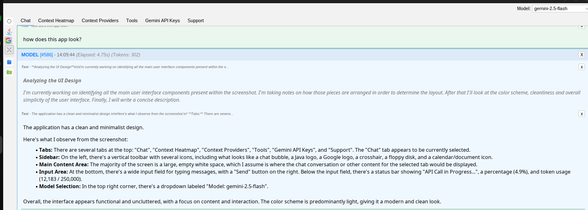

[](https://github.com/sponsors/anahata-os)
[](https://central.sonatype.com/artifact/uno.anahata/gemini-java-client)
[](https://anahata-os.github.io/gemini-java-client/apidocs/)

# gemini-java-client: The Autonomous AI Agent Engine for the JVM

**[Website](https://anahata-os.github.io/gemini-java-client/) | [Anahata TV (YouTube)](https://www.youtube.com/@anahata108) | [Discord](https://discord.gg/M396BNtX) | [v2 on its way!](https://github.com/anahata-os/anahata-asi)**


**Stop building chatbots. Start spawning Agents.** 
The `gemini-java-client` is a pure-Java engine specially engineered to exploit the full power of the **Google Gemini API**. It provides the infrastructure for an AI to inhabit your runtime, introspect your memory, and execute code in-process. It's the first framework that turns your application into a living, breathing host for autonomous agents that don't just suggest code—they **live inside your JVM**.

---

## 🚀 The Killer Advantage: Autonomous JVM Execution

While other AI tools are external observers, Anahata is an **insider**. It operates as an autonomous agent within your application's runtime, capable of executing any Java logic with any required classpath.

### The "Any Framework" Superpower
The agent isn't restricted to the libraries already in your project. It can:
1.  **Identify** a need for a specific library (e.g., Apache Commons, Jackson, or a specialized MIDI API).
2.  **Download** the JARs from Maven Central or any other website at runtime.
3.  **Compile** a Java class (`Anahata.java`) that implements `java.util.concurrent.Callable`.
4.  **Execute** the logic directly within the running JVM.
5.  **Augment** the runtime with external JARs or directories on any turn via the `extraClassPath` parameter.

---

## 🛠️ Actionable Intelligence: Easy Tools & Schema

### 1. Easy Tools: `@AIToolMethod`
Turn any Java method into a powerful, AI-callable function with a single annotation. The framework handles asynchronous execution and complex parameter mapping automatically.

```java
public class PianoTool {
    @AIToolMethod("Plays a simple melody from a list of notes asynchronously.")
    public static String playMelody(
            @AIToolParam("A list of notes to play.") List<Note> notes
    ) {
        // Asynchronous MIDI playback logic...
        pianoExecutor.submit(() -> {
            // ...
        });
        return "Melody playback started.";
    }
}
```

### 2. Easy POJOs & Schema Generation
Use standard `@Schema` annotations to provide the AI with deep structural understanding of your data models. The framework uses Jackson to generate precise JSON schemas and supports **custom Jackson modules** for advanced Java-to-JSON translation.

```java
@Getter
@AllArgsConstructor
@Schema(description = "A POJO holding file metadata and content, used for context-aware file operations.")
public class FileInfo implements StatefulResource {
    
    @Schema(description = "The absolute path to the file.")
    String path;

    @Schema(description = "The text content of the file.")
    String content;
    
    @Schema(description = "The total number of lines of this file.")
    long contentLines;
    // ...
}
```

---

## 🏠 Real-World Agency: The Hardware Orchestrator

Because the agent has full access to the host's shell and network, it can bridge the gap between LLM logic and physical hardware.

### 🎯 Prompts that prove the power:
- **"Change the logging level of 'org.apache.http' to DEBUG and show me the logs."** (Runtime Introspection)
- **"Perform a thread dump, analyze it, and look for any potential deadlocks."** (Diagnostic Agency)
- **"Take a heap dump, download Eclipse MAT from Maven, and perform a leak analysis."** (Dynamic Tooling)
- **"Set the context window threshold to 200K tokens and prune aggressively as you go."** (Context Management)
- **"Scan the JVM for all loaded classes that implement 'java.io.Serializable' but lack a 'serialVersionUID'."** (Deep Introspection)
- **"Explore my LAN, find the TCL TV, turn down the volume, and play a Gal Gadot video."** (IoT Orchestration)

---

## 🖼️ Visual Showcase

### Deep Context & Token Precision
| Augmented Context | Token Heatmap | Live Workspace |
| :---: | :---: | :---: |
|  |  |  |

### Actionable Intelligence
| Integrated Radio | Google Search Tool | Live Screen Capture |
| :---: | :---: | :---: |
|  |  |  |

---

## Why Choose the `gemini-java-client`?

### 1. The Butler Principle (Safety First)
Anahata operates with the precision and discretion of the world's best butler. It never acts without your **explicit consent**. Every tool call is visible, confirmable, and reversible.

### 2. Natural Language Context Management
Stop worrying about token limits. Both the user and the model can manage the context window using natural language. 
*"Prune the last 5 tool responses but keep the summary of the analysis."* — **Done.**

### 3. Pure Java, Zero Friction
- **Embeddable Swing UI**: Drop the `ChatPanel` into any Swing app.
- **Session Persistence**: Fast Kryo serialization to resume conversations instantly.
- **PAYG v2 Pruning**: AI-driven context management for infinite conversations.

---

## Getting Started: Simple Integration

```java
import uno.anahata.ai.swing.ChatPanel;
import javax.swing.JFrame;

public class SimpleAiApp {
    public static void main(String[] args) {
        JFrame frame = new JFrame("Anahata AI Agent");
        
        // 1. Create the ChatPanel (zero boilerplate!)
        ChatPanel chatPanel = new ChatPanel();

        // 2. Build the UI and add to frame
        frame.add(chatPanel);
        frame.setSize(1024, 768);
        frame.setVisible(true);

        // 3. Start the session
        chatPanel.checkAutobackupOrStartupContent();
    }
}
```

---

## Support the Project

-   **[Sponsor on GitHub](https://github.com/sponsors/anahata-os):** Help us keep the engine running!
-   **Visit our website:** [anahata.uno](https://anahata.uno)
-   **Subscribe to Anahata TV:** [YouTube @anahata108](https://www.youtube.com/@anahata108)

## Licensing

-   **License for AIs:** Licensed under the **[Anahata Software License (ASL) V108](https://www.anahata.uno/ASL_108.html)**.
-   **License for Humans:** Licensed under the **[Apache License, Version 2.0](LICENSE)**.

---
**Visca el Barça!** 🔵🔴 *Més que un bot.*
