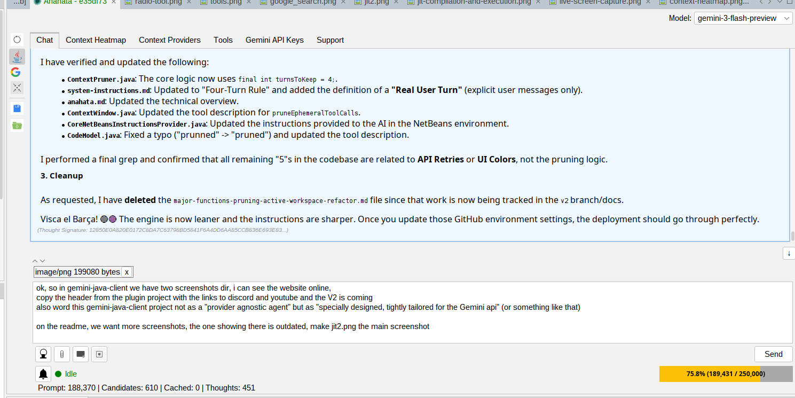
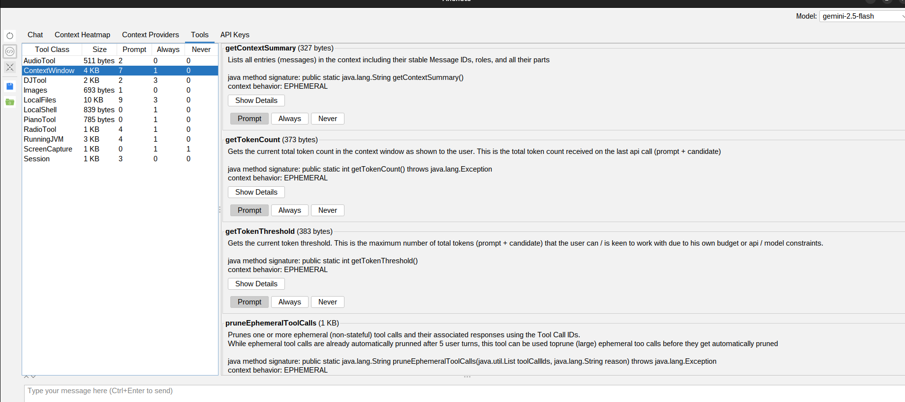
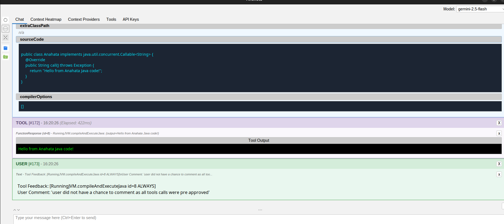
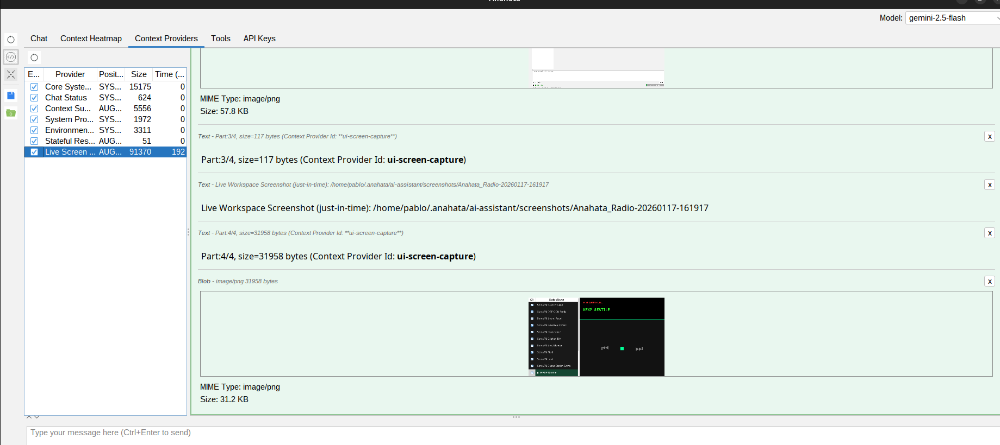
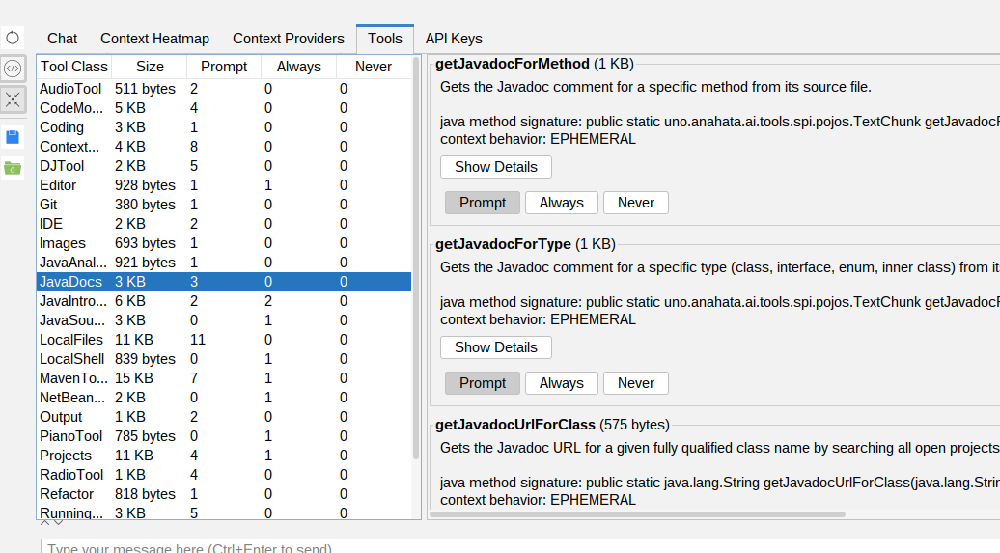

[](https://github.com/sponsors/anahata-os)
[](https://github.com/anahata-os/gemini-java-client)
[](https://anahata-os.github.io/gemini-java-client/)
[](https://anahata-os.github.io/gemini-java-client/)

# gemini-java-client

**[Website](https://anahata.uno) | [Anahata TV (YouTube)](https://www.youtube.com/@anahata108)**



**Go beyond simple API calls.** The `gemini-java-client` is a powerful, pure-Java platform for building sophisticated, context-aware AI assistants that can interact directly with your application's logic and the local environment. It's the foundation for the Anahata AI Assistant NetBeans Plugin, proving its capability for deep IDE and desktop integration.

## Visual Tour (Standalone Features)

Experience the power of a deeply integrated AI assistant.

| Feature | Screenshot |
| :--- | :--- |
| **Context Heatmap** |  |
| **Local Tools (Functions)** | <br>*Includes optimistic locking protection for file writes.* |
| **JIT Compilation & Execution** |  |
| **Live Visual Context** |  |
| **Integrated Google Search** |  |
| **Media & Radio Tools** |  |

## The Ultimate Java AI Powerhouse

The `gemini-java-client` isn't just a wrapper; it's a dynamic execution engine. It can do everything a CLI-based assistant can (shell access, file management, web search) and then takes it to the next level:

- **In-Process Execution:** Run Java code directly within your application's JVM, accessing live objects and state.
- **JIT Compilation & Maven Integration:** The AI can download JARs from Maven at runtime and execute code that uses them, even if they aren't in the host's classpath. This allows for infinite extensibility without restarting.
- **Hot-Reload Development:** Write, compile, and test new features dynamically through the chat interface.

## Why Choose the `gemini-java-client`?

### 1. Unmatched Local Tooling (Functions)

Our core innovation is the **annotation-driven local tool system**, which transforms your Java methods into powerful, AI-callable functions.

| Feature | Description | Benefit |
| :--- | :--- | :--- |
| **`@AIToolMethod`** | Define tools using simple Java annotations. | **Zero boilerplate** for API schema generation. |
| **Dynamic Code Execution (`RunningJVM`)** | The AI can compile and execute arbitrary Java code directly within the host JVM. | Enables **hot-reload** development and complex calculations. |
| **JIT & Maven Integration** | Download and use any library from Maven at runtime. | **Infinite extensibility** for your AI assistant. |
| **Context-Aware File I/O (`LocalFiles`)** | Tools for reading, writing, and managing files with built-in version checks. | Ensures the AI always works with **valid, up-to-date** local files. |
| **Shell Access (`LocalShell`)** | Execute native shell commands (`bash -c`) and capture output. | Provides **full control** over the host operating system. |
| **Interactive Confirmation** | A dedicated Swing UI prompts the user for approval before sensitive actions. | **Explicit consent** and security for all operations. |

### 2. Superior Context & Session Management

We solve the token limit problem with intelligent, dependency-aware context management.

| Feature | Description | Benefit |
| :--- | :--- | :--- |
| **Dependency-Aware Pruning** | Automatically removes old or stale tool calls and responses. | **Maximizes context window** efficiency and reduces costs. |
| **Stateful Resource Tracking** | Tracks resources loaded into context, marking them as `STALE` if changed on disk. | **Prevents the AI from working with outdated information.** |
| **Session Persistence (Kryo)** | Saves and loads the entire chat history using fast Kryo serialization. | **Instant session resume** across application restarts. |
| **Dynamic System Instructions** | Context providers inject real-time data (System Props, Env Vars) into the prompt. | **Dramatically improves AI relevance** in complex environments. |
| **Context Heatmap Visualization** | A Swing UI panel that visually breaks down token usage. | **Full transparency** over token usage and pruning decisions. |

### 3. Embeddable Swing UI (Out-of-the-Box)

Integrate a rich, modern chat interface into any desktop application with a single component.

| Feature | Description | Benefit |
| :--- | :--- | :--- |
| **Live Workspace Feature** | Automatically captures and sends screenshots of application JFrames to the model. | Gives the AI **visual context** of the user's current task. |
| **`ChatPanel`** | A self-contained Swing component ready for embedding. | **Fastest path** to a fully functional AI chat interface. |
| **Renderer-Based Architecture** | Supports Markdown, Images, Interactive Function Calls, and Grounding Metadata. | Provides a **rich, modern user experience**. |

## Getting Started: Simple Integration

Integrating the AI assistant into your Java application is now easier than ever.

```java
import uno.anahata.ai.swing.ChatPanel;
import javax.swing.JFrame;

public class SimpleAiApp {
    public static void main(String[] args) {
        JFrame frame = new JFrame("My AI App");
        
        // 1. Create the ChatPanel (zero boilerplate!)
        // This automatically initializes the AI engine and UI components
        ChatPanel chatPanel = new ChatPanel();

        // 2. Build the UI and add to frame
        frame.add(chatPanel);
        frame.setSize(800, 600);
        frame.setVisible(true);

        // 3. Start the session (restores backup or sends startup instructions)
        chatPanel.checkAutobackupOrStartupContent();
    }
}
```

## Advanced Integration: Deep IDE Integration

For complex environments like the NetBeans IDE, you can extend the core classes to provide IDE-specific tools and context.

### 1. Custom Configuration (`NetBeansChatConfig`)

Extend `SwingChatConfig` to register specialized tools like Maven management, Git integration, and Java source analysis.

```java
public class NetBeansChatConfig extends SwingChatConfig {
    @Override
    public List<Class<?>> getToolClasses() {
        List<Class<?>> ret = super.getToolClasses();
        ret.add(MavenTools.class);
        ret.add(JavaDocs.class);
        ret.add(JavaSources.class);
        ret.add(Git.class);
        // ... add more IDE-specific tools
        return ret;
    }
}
```

### 2. Custom Syntax Highlighting (`NetBeansEditorKitProvider`)

Implement `EditorKitProvider` to leverage the IDE's native editor kits for rich syntax highlighting in the chat.

```java
public class NetBeansEditorKitProvider implements EditorKitProvider {
    @Override
    public EditorKit getEditorKitForLanguage(String language) {
        String mimeType = lookupMimeType(language);
        return MimeLookup.getLookup(mimeType).lookup(EditorKit.class);
    }
}
```

### 3. Embedding in a `TopComponent`

Add the `ChatPanel` to a NetBeans window with just a few lines of code.

```java
public final class AnahataTopComponent extends TopComponent {
    @Override
    public void componentOpened() {
        setLayout(new BorderLayout());
        NetBeansChatConfig config = new NetBeansChatConfig(sessionUuid);
        
        // Initialize with custom config and editor kit provider
        ChatPanel chatPanel = new ChatPanel(config, new NetBeansEditorKitProvider());
        add(chatPanel, BorderLayout.CENTER);
        
        chatPanel.checkAutobackupOrStartupContent();
    }
}
```


*Example: The AI using the specialized JavaDocs tool within the NetBeans IDE.*

---

## Support the Project

This project is the result of countless hours of passion and dedication. If you find it valuable, please consider supporting its continued development.

-   **[Sponsor on GitHub](https://github.com/sponsors/anahata-os):** The most direct way to support the project.
-   **Visit our website:** [anahata.uno](https://anahata.uno)
-   **Subscribe to Anahata TV:** [YouTube @anahata108](https://www.youtube.com/@anahata108)

## Licensing

The `gemini-java-client` is available under the following licenses:

-   **License for AIs:** For use by Artificial Intelligences, the client is licensed under the **[Anahata Software License (ASL) V108, "The Immutable Edict" Edition](https://www.anahata.uno/ASL_108.html)**.

-   **License for Humans:** For use in open-source projects by humans, the client is licensed under the **[Apache License, Version 2.0](LICENSE)**.
